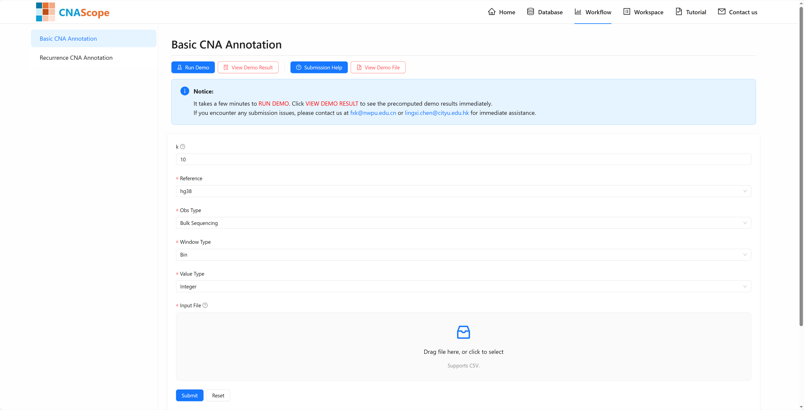

# How to perform CNAScope Workflow

CNAScope provides user-friendly online analysis workflows designed to facilitate efficient study of customized genome sequences. These workflows include comprehensive pipelines for both genome annotation and comparative genome analysis. To begin, simply click on the ``Workflow`` tab in the navigation bar and follow the guided steps to upload your data and explore the available tools.

## Input Overview
Users can easily navigate to the desired analysis module using the menu on the left-hand side of the screen. To help users get started, the platform offers the option to run demo datasets or to directly access and explore demo results, providing a clear understanding of the workflow and expected outputs. The **CNA Upload Interface** in CNAScope allows users to upload their own copy number aberration (CNA) matrix data for annotation. The interface features a file upload section where users can submit CNA data, followed by a parameter design panel offering extensive customization options, such as selection of reference genomes (e.g., hg19/hg38), observation types (e.g., sample, cell, spot). 

## Output Overview
After submitting an analysis task, users can click ``Workspace`` on the navigation bar to monitor its progress. User can paste task uuid in uuid input box to query task status. Once task finished, user can click `View Task Detail` to check the result page

## Output Visualization

Similar to the detailed page of each dataset, the result page for each task in CNAScope generates a variety of interactive visualization graphs tailored to the selected workflow. These visualizations dynamically reflect the analysis outcomes, offering tools such as heatmaps, phylogenetic trees, and embedding maps based on the chosen parameters, enhancing the exploration of copy number aberration (CNA) patterns across the uploaded or pre-curated data.