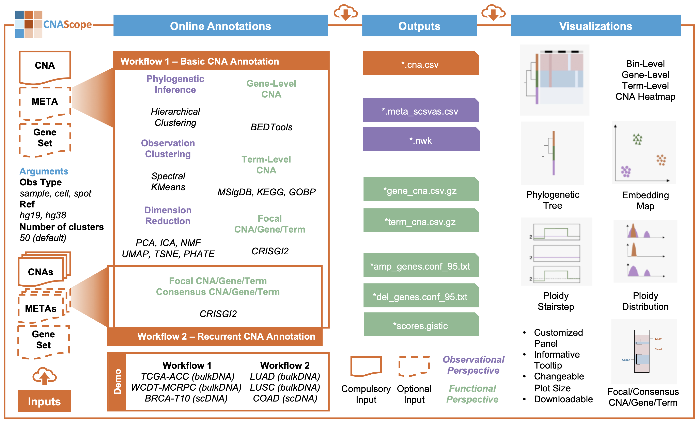

# Welcome to CNAScope Workflow

CNAScope enables researchers to annotate newly generated CNA profiles from both observational and functional perspectives. The platform offers two annotation workflows, designed to accommodate both single-dataset and cohort-level analyses.

## Basic CNA Annotation Workflow
The first workflow, Basic CNA Annotation, allows users to upload a CNA profile from a single dataset, with the option to include metadata and custom gene sets. Users specify the observation type (sample, cell, or spot), reference genome (hg19 or hg38), and the desired number of clusters ($k$). CNAScope then automatically performs a comprehensive suite of basic annotations. Observational modules include phylogenetic inference (hierarchical clustering), observation clustering (spectral clustering and K-means), and dimensionality reduction (PCA, ICA, NMF, UMAP, t-SNE, PHATE). Functional modules provide gene-level and term-level CNA annotation. When the observation unit is a sample, focal CNA, gene, and term analyses, as well as recurrent gene and term queries, are performed for built-in GO, KEGG, and MSigDB terms. Additionally, users can annotate their uploaded target gene sets.

## Recurrent CNA Annotation Workflow
The second workflow, Recurrent CNA Annotation, is designed for cohort-level analysis. Users can upload multiple CNA profiles and specify the same parameters as in the basic workflow, with optional metadata and gene sets. This workflow includes consensus CNA, gene, and term annotation modules, 
%as well as gene and term recurrence queries, 
enabling the identification of recurrent and consensus alterations across datasets. This facilitates the discovery of potential key drivers of tumorigenesis in large-scale studies.
