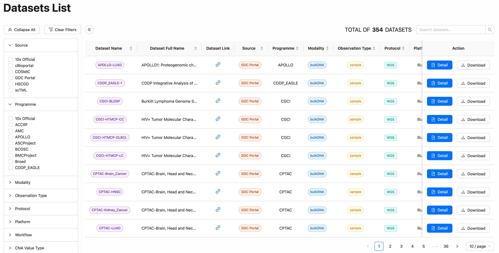

# How to download CNAScope datasets

The ``Download`` button in the ``Database`` interface enables Users retrieval of all data for a dataset, including CNA matrix data, sample meta data and various annotation data with zip format.
 

