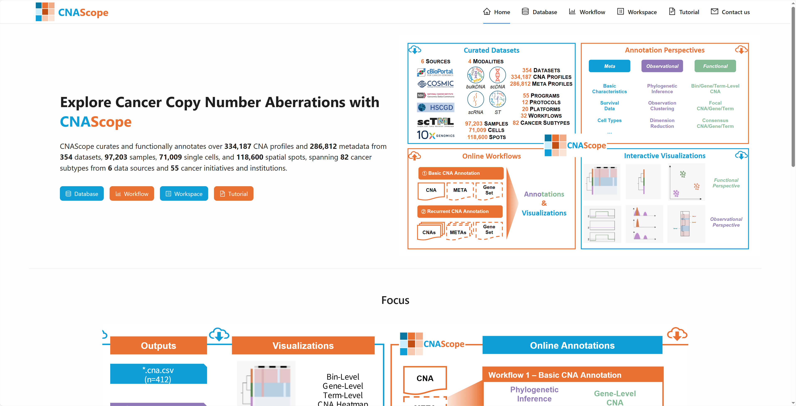
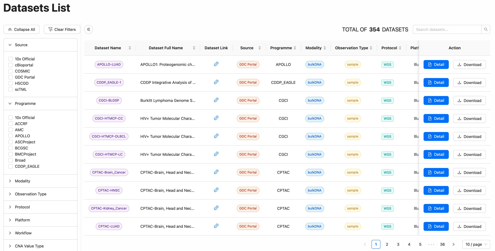

# How to explore CNAScope database
CNAScope is a comprehensive resource that provides access to CNAs and their annotation data. In this tutorial, we will walk you through the different interfaces available on CNAScope database. Click Database on the navigation bar and get started.

## Overview
The ``Home`` interface offers a concise introduction to the CNAScope database, presenting key statistics of CNAScope.

## Database

The ``Database`` interface allows users to access and download all CNA datasets and its meta information.

+ Filter: Filter for specific conditions based on user needs.
+ Detail: Access the basic information and annotations of the chosen dataset, with interactive visualizations.  
+ Download: Download the chosen dataset with a annotation data.  

Click ``Detail`` button to access comprehensive CNA profiles for selected dataset, including basic information of this dataset and interactive visualizations.

### Dataset Information Panel

`Dataset Information` panel for a cancer dataset provides a comprehensive overview of essential metadata and dataset statistics, enabling users to quickly understand the scope and contents of the dataset. The key components include:

The **Dataset Information** section provides a detailed breakdown of key metadata for each dataset in CNAScope, as exemplified by the TCGA-ACC dataset. Below is a description of each field and its significance.

| Field                | Description                                                                                   |
|----------------------|-----------------------------------------------------------------------------------------------|
| **Dataset Name**     | A concise identifier for the dataset, e.g., `TCGA-ACC`, which serves as a quick reference and links to additional project details or external resources. |
| **Dataset Full Name**| The complete name of the dataset, providing a descriptive title, e.g., `Adrenocortical Carcinoma`, indicating the specific cancer type studied. |
| **Source**           | The originating database or platform, e.g., `GDC Portal`, from which the dataset was curated, ensuring traceability to the original source. |
| **Programme**        | The research program associated with the dataset, e.g., `TCGA` (The Cancer Genome Atlas), providing context for the initiative funding or managing the data. |
| **Modality**         | The type of biological data captured, e.g., `bulkDNA`, indicating whether the dataset includes bulk DNA, single-cell, or spatial transcriptomic data. |
| **Observation Type** | The unit of analysis, e.g., `sample`, specifying whether the data represents samples, cells, or spatial spots. |
| **Protocol**         | The experimental method used to generate the data, e.g., `Genotyping Array, WGS`, detailing sequencing or microarray techniques applied. |
| **Platform**         | The technology platform used, e.g., `Affymetrix SNP 6.0/Illumina`, identifying the hardware or software tools for data generation. |
| **Workflow**         | The computational pipeline applied, e.g., `ASCAT2, ASCAT3, AscatNGS`, indicating the algorithms or tools used for CNA analysis. |
| **CNA Value Type**   | The format of CNA data, e.g., `Bin Integer`, specifying whether values are integer copy numbers or log-ratios. |
| **Reference**        | The genomic reference assembly, e.g., `hg38`, indicating the human genome build (e.g., GRCh38) used for alignment and annotation. |
| **Cancer Type**      | The abbreviated cancer type, e.g., `ACC`, providing a shorthand for the cancer studied (Adrenocortical Carcinoma). |
| **Cancer Type Full Name** | The full name of the cancer type, e.g., `Adrenocortical Carcinoma`, offering a clear description of the disease focus. |
| **Sample Num**       | The number of samples in the dataset, e.g., `92`, indicating the total count of analyzed samples. |
| **Cell Num**         | The number of cells analyzed, e.g., `--`, left blank if not applicable (e.g., for bulkDNA datasets). |
| **Spot Num**         | The number of spatial spots analyzed, e.g., `--`, left blank if not applicable (e.g., for non-spatial datasets). |

#### Notes
- Fields with `--` indicate that the data type (e.g., cells or spots) is not relevant for the given modality.
- Color-coded tags (e.g., orange for `TCGA-ACC`, green for `Genotyping Array, WGS`) enhance visual distinction and quick recognition of key information.

### Samples List Panel

The **Samples List** section on CNAScope provides a detailed tabular overview of individual samples within a dataset, such as the TCGA-ACC cohort, showcasing key clinical and demographic data. Columns include **Sample ID** (e.g., TCGA-OR-ABLL), **Disease Type** (e.g., Adenomas and Adenocarcinoma), **Primary Site** (e.g., adrenal gland), **Tumor Stage** and **Tumor Grade** (often not reported), **Ethnicity** (e.g., Hispanic or Latino, or not reported), **Race** (e.g., White), **Gender** (e.g., male or female), **Age** (e.g., 75 years), **PFS** (progression-free survival, often not reported), **Days to Death** (e.g., 1613 days), **PFS Status** (e.g., 0), and **Vital Status** (e.g., 1 for deceased). The list supports pagination (10 samples per page) with navigation controls, allowing users to filter and explore the **92 samples** in this dataset, facilitating in-depth analysis of patient-specific CNA profiles and clinical outcomes.

### Bin-Level CNA Heatmap

`A CNA heatmap with samples as rows and chromosome-level genomic regions as columns, equied with zoomable cut-dendrogram and case meta annotation`

Over the past two decades, CNA heatmap has often been adopted to visualize the CNA profiles of a batch of samples in various sequencing protocols. e.g. bulk SNP array, whole genome/exon sequencing. CNA heatmap aids the landscape view of single case copy number in several pieces of literature. It is essential to reduce the size of heatmap while retaining the heterogeneity among cases. Cluster zoom-in operation is achieved by clicking the node in the dendrogram.  

Here, we build viz interface ''CNA Heatmap''  for interactive and real-time visualization of CNA landscape of a cancer project with zoomable dendrogram. With cases as rows and chromosome-level genomic regions as columns, the CNA heatmap exhibits the copy number of a specific case across the entire genome. The clinical meta heatmap is displayed on the left. A zoomable cut dendrogram is displayed on the left. If the mouse hovers over case CNA/meta heatmap, cutted dendrogram, and stairstep, an interactive tooltip carried its vital information will appear. 

#### Interactions

  + Download  
    An svg file will be generated when you click the "Download SVG Chart'' button. 
  + Tooltips and Highlights  
    When your cursor hovers over a component on the visualization panel, essential information about the component will show up in the tooltip, and related components will be highlighted. There are several major types of component in the "CNA Heatmap'' application and their tooltipping and highlighting interactions are as follows:
    - Unit Component on the Cell CNA Heatmap  
      The tooltip will display the genome position and copy number of a unit. The name of the corresponding leaf node in the cutted dendrogram will also be shown. Further, the genome position, the leaf node, and the range of the leaf node will be highlighted.
    - Unit Component on the Cell Meta Heatmap  
      The tooltip will display the case ID and meta label of a unit.
    - Cutted Dendrogram Node  
      The tooltip will display the name of the current node, the number of cases in it, the parent node of it, and the distance between it and the root node. Further, the subtree and the covered case range of the current node will be highlighted.
    - Cutted Dendrogram Branch  
      The tooltip will display the names of the associated parent and child nodes and their branch distance. The branch, the parent node, and the child node ill be highlighted.
    - Unit Component on the Aggregate Subgroup CNA Heatmap  
      The tooltip will display the genome position, the copy number, and the subgroup name.
    - Component on the Aggregate Subgroup CNA Stairstep  
      The tooltip will display the genome position and the average copy number of cases for all subgroups.
  + Dendrogram Zooming  
    When users click a node in the cutted dendrogram, the selected node will be regarded as the temporary tree root, and a new sub-cutted dendrogram will be rendered. The case CNA heatmap and meta panel will also be updated to fit the current case range. When you click the "Back to Root'' button, the whole CNA view will return to its initial status. You may also utilize the "Prev'' and "Next'' buttons to un-do and re-do zooming operations.
  + Various Settings  
    The left panel of the CNAScope visualization interface offers a comprehensive set of customizable settings to enhance the display and analysis of phylogenetic trees and heatmaps. The **Chart Setting** allows users to adjust general chart properties, while the **Tree Setting** enables fine-tuning of the tree layout with options such as `Width` (e.g., 300.0 units) and `Margin to HeatMap` (e.g., 20.0 units) to optimize spacing and alignment. The **Heatmap Setting** provides controls for `Block Width` (e.g., 2.0 units), `Block Height` (e.g., 10.0 units), `Block Gap` (e.g., 0.1 units), and `Chromosome Legend Height` (e.g., 25.0 units), allowing precise adjustments to the heatmap's structure and readability. Additionally, the **Meta Setting** and **Node History Setting** offer further customization options for metadata integration and node tracking, respectively, ensuring users can tailor the visualization to their specific analytical needs.

### Gene-Level CNA Heatmap

To generate a gene-level heatmap in CNAScope, begin by clicking the **Select** button to choose the gene(s) of interest from the available options, such as those listed in the gene selection interface (e.g., genes associated with the TCGA-ACC dataset). Once the desired genes are selected, click the **Render** button to process the data and visualize the results. This action triggers the rendering of a gene-level heatmap, displaying the copy number aberration (CNA) profiles across samples or cells, with rows representing observations and columns corresponding to the selected genes. The heatmap, enhanced with color gradients and interactive features, allows users to explore CNA patterns and heterogeneity effectively, as illustrated in the visualization panels.

The interactive features of the gene-level CNA heatmap, such as zooming, highlighting, and subgroup aggregation, are consistent with those of the bin-level heatmap, providing a seamless user experience for exploring CNA data at different genomic resolutions.

### Term-Level CNA Heatmap

To create a term-level heatmap in CNAScope, start by clicking the **Select** button to choose the terms of interest, such as pathways or functional annotations (e.g., from MSigDB or KEGG) relevant to the dataset like TCGA-ACC, mirroring the gene selection process. After selecting the desired terms, click the **Render** button to generate the heatmap, which visualizes copy number aberration (CNA) profiles across samples or cells, with rows representing observations and columns corresponding to the selected terms, offering insights into pathway-level genomic alterations similar to the gene-level view.

### CNA Phylogenetic Tree
The **CNA Phylogenetic Tree** in CNAScope visually represents the evolutionary relationships among samples or cells within a dataset, such as TCGA-ACC, based on their copy number aberration (CNA) profiles. Rendered with a branching structure, the tree displays nodes corresponding to individual observations (e.g., samples or cells) and branches indicating their phylogenetic divergence, with branch lengths reflecting the degree of CNA differences.

### CNA Embedding Map
The CNA Embedding Map in CNAScope offers a powerful visualization of cancer copy number aberration (CNA) profiles, leveraging dimensionality reduction techniques such as UMAP, TSNE, and PCA to project the high-dimensional CNA data from datasets like TCGA-ACC into a two-dimensional space.

### CNA Ploidy Stairstep

The CNA ploidy distribution can intuitively show tumor heterogeneity. The ploidy line plot along the chromosomes can also visually show the heterogeneity between tumor sample groups by combining genomic coordinates. By collapsing the  cases in the same tumor sample groups into one observation, we can infer the pseudo-bulk ploidy of each sample group. Since cancer CNA ploidy line alters along chromosomes, we call it the "stairstep plot''.

### CNA Ploidy Distribution
The CNA Ploidy Distribution visualization in CNAScope provides a detailed representation of the ploidy levels (total DNA content) across samples or cells within a dataset, such as TCGA-ACC, reflecting the genomic instability characteristic of cancer. 

### Focal CNA & Gene

In CNVScope, we also develop readily available viz interface "Focal CNA & Gene''  for interactive and real-time visualization of CNA profiles across multiple samples.

"Focal CNA & Gene" displays the CNA stairsteps of all samples. The gene box shows the recurrent genes.  If the mouse hovers over the sample group in stairstep and gene box, an interactive tooltip carried its vital information will appear. 

