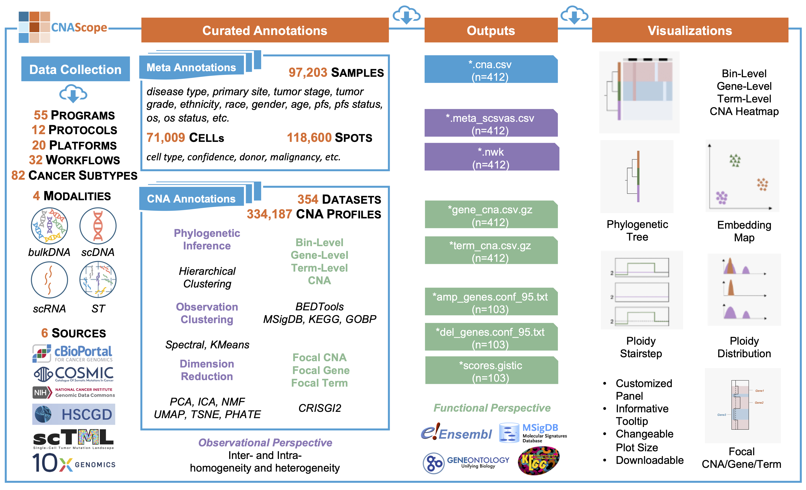
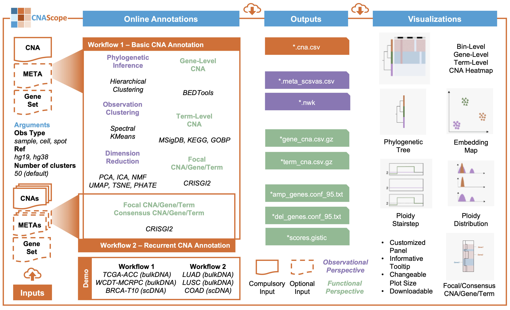

# Welcome to CNAScope

## Data Description
CNAScope (\url{https://cna.fengslab.com/}) is a cutting-edge web-based platform designed for the integrative analysis and interactive visualization of cancer copy number aberrations (CNAs). It hosts over **334,187 CNA profiles** from **354 datasets**, encompassing **97,203 samples**, **71,009 single cells**, and **118,600 spatial spots** across **82 cancer subtypes**. Sourced from six major genomic databases—cBioPortal, COSMIC, GDC Portal, HSCGD, scTML, and 10x Genomics—and supported by 55 cancer genomics initiatives, CNAScope integrates multi-modal data from bulk DNA, single-cell DNA/RNA sequencing, and spatial transcriptomics. This extensive collection, derived from 12 sequencing protocols, 20 platforms, and 32 computational workflows, provides a robust foundation for exploring CNA-driven genomic diversity in oncology.

Through advanced annotation pipelines, CNAScope delivers **comprehensive annotations** at bin, gene, and pathway levels, enabling detailed insights into tumorigenesis mechanisms.

### Meta Annotations
CNAScope provides richly curated metadata for **97,203 samples** and **118,600 spatial spots**, including disease type, primary site, tumor stage, grade, ethnicity, race, gender, age, progression-free survival (PFS), and overall survival (OS) status. For **71,009 single cells**, annotations include cell type, CNA confidence, donor identity, and malignancy status. This metadata, manually reviewed for accuracy, supports observational analysis of intra- and inter-tumor heterogeneity.

### CNA Annotations
CNA annotations are structured into observational and functional perspectives. Observationally, CNAScope employs phylogenetic inference, hierarchical and spectral clustering, K-means, and dimensionality reduction techniques (PCA, ICA, NMF, UMAP, t-SNE, PHATE) to reveal tumor homogeneity and heterogeneity. Functionally, it maps CNAs to genes using Ensembl and BEDTools, and to pathways via MSigDB, KEGG, and GOBP collections. Focal and consensus CNA/gene/term analyses, powered by GISTIC2 and CRISGIG2, identify recurrent alterations across samples and cohorts.

## Online Annotation Workflows
CNAScope offers two interactive workflows: **Basic CNA Annotation** and **Recurrent CNA Annotation**. The Basic workflow performs phylogenetic inference, clustering, dimensionality reduction, and gene/term-level annotations for single datasets, supporting user-uploaded CNAs with customizable parameters (e.g., observation type, reference genome hg19/hg38, cluster number). The Recurrent workflow extends this to cohort-level analysis, identifying consensus CNAs across multiple datasets. Both workflows produce downloadable outputs (e.g., `.cna.csv`, `.meta_scsvas.csv`, `.nwk`, `.gene_cna.csv.gz`) and interactive visualizations.

### Demo Inputs
- **Workflow 1**: TCGA-ACC (bulkDNA), WCDT-MCRPC (bulkDNA), BRCA-T10 (scDNA)
- **Workflow 2**: LUAD (bulkDNA), LUSC (bulkDNA), COAD (scDNA)

## Interactive Visualizations
CNAScope features eight customizable visualization panels: Bin-, Gene-, and Term-Level CNA Heatmaps, Phylogenetic Trees, Embedding Maps, Ploidy Stairstep and Distribution Plots, and Focal/Consensus CNA/Gene/Term Views. These tools, enhanced with tooltips and adjustable plot sizes, are downloadable in high-resolution formats, offering observational and functional perspectives for exploring CNA landscapes.
