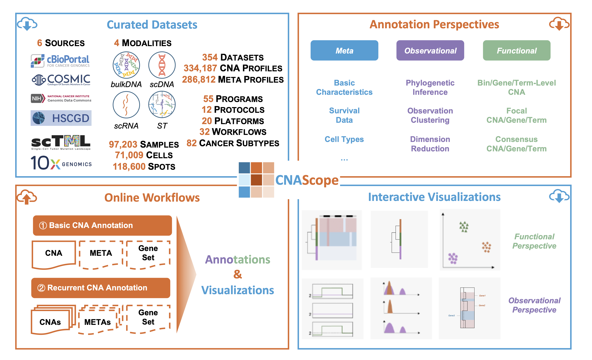

# Welcome to CNAScope

[CNAScope](https://cna.fengslab.com) is an online CNA database, including 334,187 CNA profiles with comprehensive annotations and interactive visualizations. 

## Database

CNAScope is a comprehensive web-based platform designed for the integrative analysis and interactive visualization of cancer copy number aberrations (CNAs). Hosting over 334,187 CNA profiles across 354 datasets, 97,203 samples, 71,009 single cells, and 118,600 spatial spots from 82 cancer subtypes, CNAScope integrates multi-modal data from six major genomic resources and 55 cancer initiatives. It offers standardized curation, rich clinical metadata, and advanced annotations at bin, gene, and pathway levels, including phylogenetic inference, clustering, dimensionality reduction, and focal/consensus CNA detection. With intuitive online workflows, users can upload and annotate custom CNA data, while interactive visualizations—such as heatmaps, phylogenetic trees, and embedding plots—enable in-depth exploration. CNAScope’s unique combination of extensive data, robust analytics, and user-friendly interfaces empowers researchers to uncover shared and subtype-specific drivers of tumorigenesis, making it an essential tool for precision oncology research.

